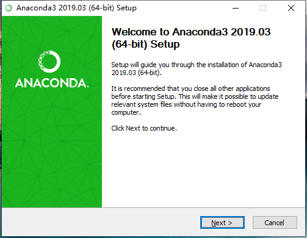
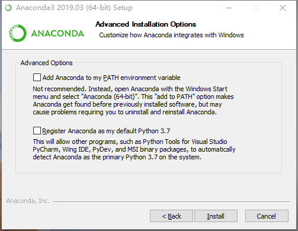
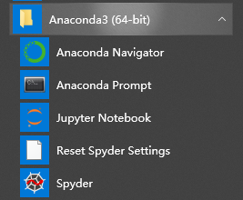

# anaconda安装

## 1、解决的问题：
- 到底装python2还是python3

>python2和python3在语法上是不兼容的,加入你安装的是Python2, 但是如果你要开发的程序必须使用python3而不能使用python2,那这时候你就必须下载安装python3, 并且环境变量也要切换。

- 第三方包管理
>在用python做数据分析的过程中，最令人头痛的就是python的各种包的管理，比如pandas,numpy,matplotlib等。

## 2、介绍
Anaconda指的是一个开源的Python发行版本，其包含了conda、Python等180多个科学包及其依赖项。 因为包含了大量的科学包，Anaconda 的下载文件比较大，如果只需要某些包，或者需要节省带宽或存储空间，也可以使用Miniconda这个较小的发行版（仅包含conda和 Python）。  

Conda是一个开源的包、环境管理器，可以用于在同一个机器上安装不同版本的软件包及其依赖，并能够在不同的环境之间切换。

## 3、安装过程
下载地址：https://www.anaconda.com/distribution/#download-section

> - Anaconda Navigtor ：用于管理工具包和环境的图形用户界面，后续涉及的众多管理命令也可以在 Navigator 中手工实现。  
> - Jupyter notebook ：基于web的交互式计算环境，可以编辑易于人们阅读的文档，用于展示数据分析的过程。
> - qtconsole ：一个可执行 IPython 的仿终端图形界面程序，相比 Python Shell 界面，qtconsole 可以直接显示代码生成的图形，实现多行代码输入执行，以及内置许多有用的功能和函数。
> - spyder ：一个使用Python语言、跨平台的、科学运算集成开发环境。

## 4、python2和python3切换
