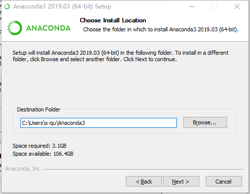

# anaconda安装

## 解决的问题：
- 到底装python2还是python3

>python2和python3在语法上是不兼容的,加入你安装的是Python2, 但是如果你要开发的程序必须使用python3而不能使用python2,那这时候你就必须下载安装python3, 并且环境变量也要切换。

- 第三方包管理
>在用python做数据分析的过程中，最令人头痛的就是python的各种包的管理，比如pandas,numpy,matplotlib等。

## 安装过程
下载地址：https://www.anaconda.com/distribution/#download-section

