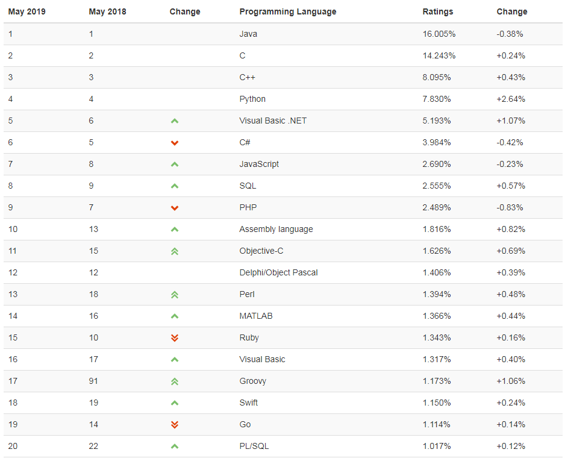
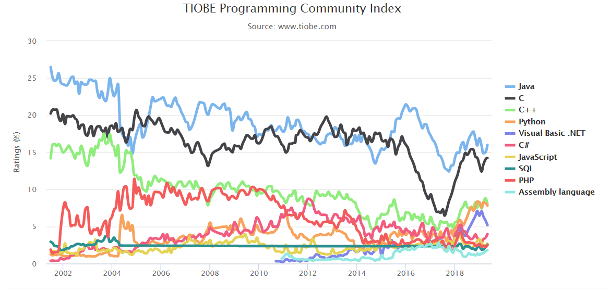

# 前言

## 简介
Python 是著名的“龟叔” Guido van Rossum 在 1989 年圣诞节期间，为了打发无聊的圣诞节而编写的一个编程语言。

现在，全世界差不多有 600 多种编程语言，但流行的编程语言也就那么 20 来种。

**2019年5月TIOBE编程语言排行榜TOP 20 榜单：**

**TOP 10 编程语言 TIOBE 指数走势（2002-2018）**

总的来说，这几种编程语言各有千秋，但不难看出，最近几年 Python 的发展非常的快，特别最近流行的机器学习，数据分析，更让 python 快速的发展起来。

Python 是高级编程语言，它有一个特点就是能快速的开发。Python 为我们提供了非常完善的基础代码库，覆盖了网络、文件、GUI、数据库、文本等大量内容，被形象地称作“内置电池（batteries included）”。用 Python 开发，许多功能不必从零编写，直接使用现成的即可。而且 Python 还能开发网站，多大型网站就是用 Python 开发的，例如 YouTube、Instagram，还有国内的豆瓣。很多大公司，包括 Google、Yahoo 等，甚至 NASA（美国航空航天局）都大量地使用 Python。

当然，任何编程语言有有点，也有缺点，Python 也不例外。那么 Python 有哪些缺点呢？

- 第一个缺点就是运行速度慢，和C程序相比非常慢，因为Python是解释型语言，你的代码在执行时会一行一行地翻译成CPU能理解的机器码，这个翻译过程非常耗时，所以很慢。而C程序是运行前直接编译成CPU能执行的机器码，所以非常快。

- 第二个缺点就是代码不能加密。如果要发布你的 Python 程序，实际上就是发布源代码。像C++ C 这些编译型的语言，都没有这个问题，而解释型的语言，则必须把源码发布出去。

---

## 目录
- [**python解释器安装**](./python_install.md)

- [**anaconda安装**](./anaconda_install.md)

