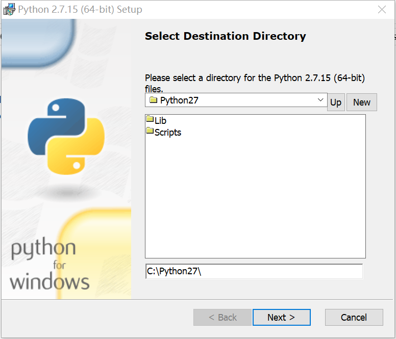

# python解释器安装

Python 是跨平台的，它可以运行在 Windows、Mac 和各种 Linux/Unix 系统上。目前，Python 有两个版本，一个是 2.x 版，一个是 3.x版，这两个版本是不兼容的。语法存在些许差异。python2只维护到2020年。但目前的python2的使用量还是大于3的。

**两点建议：**

 - 使用Python 2，不要使用Python 2.7以前的版本。

 - 使用Python 3，不要使用Python 3.4以前的版本。

解释器下载地址：https://www.python.org/downloads/

## 1、安装步骤

**验证是否安装成功**

## 2、可以执行python程序的重要两点
  - 解释器

  - 包集合

**包集合**中包含了自带的包和第三方包, 第三方包我们一般通过pip或者easy_install来下载, 当一个python环境中不包含这个包, 那么引用了这个包的程序不能在该python环境中运行.

