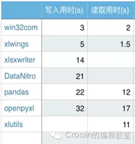
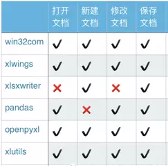

# 库-openpyxl #
python处理excel已经有大量包，主流代表有：
•xlwings：简单强大，可替代VBA

•openpyxl：简单易用，功能广泛

•pandas：使用需要结合其他库，数据处理是pandas立身之本

•win32com：不仅仅是excel，可以处理office;不过它相当于是 windows COM 的封装，新手使用起来略有些痛苦。

•Xlsxwriter：丰富多样的特性，缺点是不能打开/修改已有文件，意味着使用 xlsxwriter 需要从零开始。

•DataNitro：作为插件内嵌到excel中，可替代VBA，在excel中优雅的使用python

•xlutils：结合xlrd/xlwt，老牌python包，需要注意的是你必须同时安装这三个库

 

openpyxl（可读写excel表）专门处理Excel2007及以上版本产生的xlsx文件，xls和xlsx之间转换容易

注意：如果文字编码是“gb2312” 读取后就会显示乱码，请先转成Unicode。


**最重要的三种数据格式：**

- NULL空值：对应于python中的None，表示这个cell里面没有数据。
- numberic： 数字型，统一按照浮点数来进行处理。对应于python中的float。
- string： 字符串型，对应于python中的unicode。

**Excel文件三个对象：**
- workbook： 工作簿，一个excel文件包含多个sheet。
- sheet：工作表，一个workbook有多个，表名识别，如“sheet1”,“sheet2”等。
- cell： 单元格，存储数据对象

---

## 1、创建已给excel文件并写入内容
```python
from openpyxl import Workbook
wb = Workbook()    #创建文件对象

# grab the active worksheet
ws = wb.active     #获取第一个sheet

# Data can be assigned directly to cells
ws['A1'] = 42      #写入数字
ws['B1'] = "你好"+"automation test" #写入中文（unicode中文也可）

# Rows can also be appended
ws.append([1, 2, 3])    #写入多个单元格

# Python types will automatically be converted
import datetime
import time
ws['A2'] = datetime.datetime.now()    #写入一个当前时间
#写入一个自定义的时间格式
ws['A3'] =time.strftime("%Y-%m-%d %H:%M:%S:",time.localtime())

# Save the file  [e:\\sample01.xlsx]
wb.save("sample01.xlsx")
```

## 2、创建sheet ##
```python
from openpyxl import Workbook
wb = Workbook()

ws1 = wb.create_sheet("Mysheet")           #创建一个sheet
ws1.title = "New Title"                    #设定一个sheet的名字
ws2 = wb.create_sheet("Mysheet", 0)      #设定sheet的插入位置 默认插在后面
ws2.title = u"你好"    #设定一个sheet的名字 必须是Unicode

ws1.sheet_properties.tabColor = "1072BA"   #设定sheet的标签的背景颜色

#获取某个sheet对象
print(wb.get_sheet_by_name(u"你好"  ))
print(wb["New Title" ])

#获取全部sheet 的名字，遍历sheet名字
print(wb.sheetnames)
for sheet_name in wb.sheetnames:
    print(sheet_name)

print("*"*50)

for sheet in wb:
    print(sheet.title)

#复制一个sheet
wb["New Title" ]["A1"]="zeke"
source = wb["New Title" ]
target = wb.copy_worksheet(source)

# w3 = wb.copy_worksheet(wb['new title'])
# ws3.title = 'new2'
# wb.copy_worksheet(wb['new title']).title = 'hello'
# Save the file
wb.save("sample02.xlsx")
```

---


## 3、操作单元格 ##
```python
from openpyxl import Workbook
wb = Workbook()
ws1 = wb.create_sheet("Mysheet")           #创建一个sheet

ws1["A1"]=123.11
ws1["B2"]="你好"
d = ws1.cell(row=4, column=2, value=10)

print(ws1["A1"].value)
print(ws1["B2"].value)
print(d.value)

# Save the file
wb.save("sample03.xlsx")
```

---

## 4、操作批量的单元格 ##
无论ws.rows还是ws.iter_rows都是一个对象

除上述两个对象外 单行，单列都是一个元祖，多行多列是二维元祖

```python
from openpyxl import Workbook
wb = Workbook()

ws1 = wb.create_sheet("Mysheet")           #创建一个sheet

ws1["A1"]=1
ws1["A2"]=2
ws1["A3"]=3

ws1["B1"]=4
ws1["B2"]=5
ws1["B3"]=6

ws1["C1"]=7
ws1["C2"]=8
ws1["C3"]=9

#操作单列
print(ws1["A"])
for cell in ws1["A"]:
    print(cell.value)

#操作多列,获取每一个值
print(ws1["A:C"])
for column in ws1["A:C"]:
    for cell in column:
        print(cell.value)

#操作多行
row_range = ws1[1:3]
print(row_range)
for row in row_range:
    for cell in row:
        print(cell.value)

print("*"*50)
for row in ws1.iter_rows(min_row=1, min_col=1, max_col=3, max_row=3):
    for cell in row:
        print(cell.value)

#获取所有行
print(ws1.rows)
for row in ws1.rows:
    print(row)

print("*"*50)
#获取所有列
print(ws1.columns)
for col in ws1.columns:
    print(col)

wb.save("sample04.xlsx")
```

使用百分号-打印小数：
```python
from openpyxl import Workbook
from openpyxl import load_workbook
wb = load_workbook('e:\\sample.xlsx')
wb.guess_types = True
ws=wb.active
ws["D1"]="12%"
print(ws["D1"].value)

# Save the file
wb.save("e:\\sample.xlsx")
#结果会打印小数
```

使用百分号-打印百分号：
```python
from openpyxl import Workbook
from openpyxl import load_workbook
wb = load_workbook('e:\\sample.xlsx')
wb.guess_types = False
ws=wb.active
ws["D1"]="12%"
print(ws["D1"].value)
wb.save("sample04.xlsx")
#结果会打印百分数
```

---

## 5、获取所有的行对象 ##
```python
from openpyxl import Workbook
from openpyxl import load_workbook
wb = load_workbook('sample04.xlsx')
ws=wb.active
rows=[]
for row in ws.iter_rows():
    rows.append(row)
print(rows)   #所有行
print(rows[0])  #获取第一行
print(rows[0][0])  #获取第一行第一列的单元格对象
print(rows[0][0].value)  #获取第一行第一列的单元格对象的值
 
print(rows[len(rows)-1])  #获取最后行 print(rows[-1]
print(rows[len(rows)-1][len(rows[0])-1])  #获取第后一行和最后一列的单元格对象
print(rows[len(rows)-1][len(rows[0])-1].value)  #获取第后一行和最后一列的单元格对象的值
```

---

## 6、操作已经存在的文件 ##
```python
from openpyxl import Workbook
from openpyxl import load_workbook
wb = load_workbook('sample04.xlsx')
wb.guess_types = True   #猜测格式类型
ws=wb.active
ws["D1"]="12%"
print ws["D1"].value

# Save the file
wb.save("sample06.xlsx")
#注意如果原文件有一些图片或者图标，则保存的时候可能会导致图片丢失
```

---

## 7、单元格类型 ##
```python
from openpyxl import Workbook
from openpyxl import load_workbook
import datetime
wb = load_workbook('sample04.xlsx')

ws=wb.active
wb.guess_types = True

ws["A1"]=datetime.datetime(2010, 7, 21)
print(ws["A1"].number_format)

ws["A2"]="12%"
print(ws["A2"].number_format)

ws["A3"]= 1.1
print(ws["A4"].number_format)

ws["A4"]= "中国"
print(ws["A5"].number_format)
# Save the file
wb.save("sample07.xlsx")
# #如果是常规，显示general,如果是数字，显示'0.00_ '，如果是百分数显示0%,数字需要在Excel中设置数字类型，直接写入的数字是常规类型
```

---

## 8、使用公式 ##
```python
from openpyxl import Workbook
from openpyxl import load_workbook

wb = load_workbook('e:\\sample.xlsx')
ws1=wb.active

ws1["A1"]=1
ws1["A2"]=2
ws1["A3"]=3

ws1["A4"] = "=SUM(1, 1)"
ws1["A5"] = "=SUM(A1:A3)"

print(ws1["A4"].value)  #打印的是公式内容，不是公式计算后的值,程序无法取到计算后的值
print(ws1["A5"].value)  #打印的是公式内容，不是公式计算后的值,程序无法取到计算后的值

# Save the file
wb.save("sample08.xlsx")
```

[**详细案例链接**](https://www.cnblogs.com/zeke-python-road/p/8986318.html)