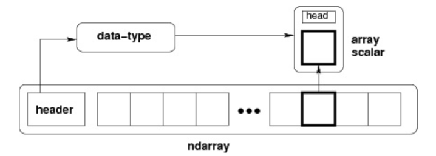

# 库-numpy #
NumPy(Numerical Python) 是 Python 语言的一个扩展程序库，支持大量的维度数组与矩阵运算，此外也针对数组运算提供大量的数学函数库。

NumPy 的前身 Numeric 最早是由 Jim Hugunin 与其它协作者共同开发，2005 年，Travis Oliphant 在 Numeric 中结合了另一个同性质的程序库 Numarray 的特色，并加入了其它扩展而开发了 NumPy。NumPy 为开放源代码并且由许多协作者共同维护开发。

NumPy 是一个运行速度非常快的数学库，主要用于数组计算，包含：

- 一个强大的N维数组对象 ndarray
- 广播功能函数
- 整合 C/C++/Fortran 代码的工具
- 线性代数、傅里叶变换、随机数生成等功能

## NumPy 应用 ##
NumPy 通常与 SciPy（Scientific Python）和 Matplotlib（绘图库）一起使用， 这种组合广泛用于替代 MatLab，是一个强大的科学计算环境，有助于我们通过 Python 学习数据科学或者机器学习。

SciPy 是一个开源的 Python 算法库和数学工具包。

SciPy 包含的模块有最优化、线性代数、积分、插值、特殊函数、快速傅里叶变换、信号处理和图像处理、常微分方程求解和其他科学与工程中常用的计算。

Matplotlib 是 Python 编程语言及其数值数学扩展包 NumPy 的可视化操作界面。它为利用通用的图形用户界面工具包，如 Tkinter, wxPython, Qt 或 GTK+ 向应用程序嵌入式绘图提供了应用程序接口（API）。

## 1、NumPy Ndarray对象 ##
NumPy 最重要的一个特点是其 N 维数组对象 ndarray，它是一系列同类型数据的集合，以 0 下标为开始进行集合中元素的索引。

ndarray 对象是用于存放同类型元素的多维数组。

ndarray 中的每个元素在内存中都有相同存储大小的区域。

ndarray 内部由以下内容组成：

- 一个指向数据（内存或内存映射文件中的一块数据）的指针。

- 数据类型或 dtype，描述在数组中的固定大小值的格子。

- 一个表示数组形状（shape）的元组，表示各维度大小的元组。

- 一个跨度元组（stride），其中的整数指的是为了前进到当前维度下一个元素需要"跨过"的字节数。

ndarray 的内部结构:


跨度可以是负数，这样会使数组在内存中后向移动，切片中 obj[::-1] 或 obj[:,::-1] 就是如此。

创建一个 ndarray 只需调用 NumPy 的 array 函数即可：

    numpy.array(object, dtype = None, copy = True, order = None, subok = False, ndmin = 0)

参数说明：
|   名称	|   描述|
|   ---	|   ---|
|   object	|   数组或嵌套的数列|
|   dtype	|   数组元素的数据类型，可选|
|   copy	|   对象是否需要复制，可选|
|   order	|   创建数组的样式，C为行方向，F为列方向，A为任意方向（默认）|
|   subok	|   默认返回一个与基类类型一致的数组|
|   ndmin	|   指定生成数组的最小维度|


### （1）创建 ###
实例1：
```python
import numpy as np 
a = np.array([1,2,3])  
print (a)
```
输出结果：
    [1, 2, 3]

实例2：
```python
# 多于一个维度  
import numpy as np 
a = np.array([[1,  2],  [3,  4]])  
print (a)
```
输出结果：

    [[1, 2] 
    [3, 4]]

实例3：
```python
# 最小维度  
import numpy as np 
a = np.array([1,  2,  3,4,5], ndmin =  2)  
print (a)
```
输出结果:

    [[1, 2, 3, 4, 5]]

实例4：
```python
import numpy as np 
a = np.arange(15).reshape(3,5)
print(a,a.shape)

# arrage函数的第一参数表示数列的起始值，第二个参数是数列的上界，取不到，第三参数表示数列之间的距离
print(np.arange( 10, 30, 5 ))
# 结果： array([10, 15, 20, 25])
```


ndarray 对象由计算机内存的连续一维部分组成，并结合索引模式，将每个元素映射到内存块中的一个位置。内存块以行顺序(C样式)或列顺序(FORTRAN或MatLab风格，即前述的F样式)来保存元素。
