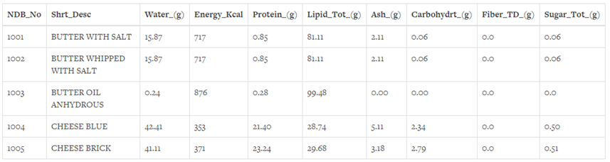
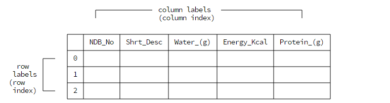
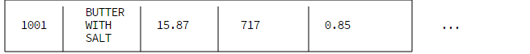
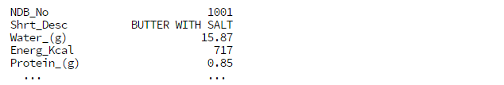
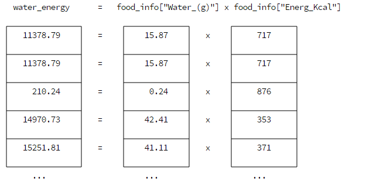

# 库-pandas #
Pandas使用一个二维的数据结构DataFrame来表示表格式的数据，相比较于Numpy，Pandas可以存储混合的数据结构，同时使用NaN来表示缺失的数据，而不用像Numpy一样要手工处理缺失的数据，并且Pandas使用轴标签来表示行和列。
 
## 1、读取数据 ##
Pandas使用函数read_csv()来读取csv文件
```python
import pandas

food_info = pandas.read_csv('food_info.csv')

print(type(food_info))
# 输出：<class 'pandas.core.frame.DataFrame'> 可见读取后变成一个DataFrame变量
```

该文件的内容如下：


使用函数head( m )来读取前m条数据，如果没有参数m，默认读取前五条数据。
```python
first_rows = food_info.head()

first_rows = food_info.head(3)
```

由于DataFrame包含了很多的行和列，Pandas使用省略号（...）来代替显示全部的行和列，可以使用colums属性来显示全部的列名.

    print(food_info.columns)
    # 输出：输出全部的列名，而不是用省略号代替

    Index(['NDB_No', 'Shrt_Desc', 'Water_(g)', 'Energ_Kcal', 'Protein_(g)', 'Lipid_Tot_(g)', 'Ash_(g)', 'Carbohydrt_(g)', 'Fiber_TD_(g)', 'Sugar_Tot_(g)', 'Calcium_(mg)', 'Iron_(mg)', 'Magnesium_(mg)', 'Phosphorus_(mg)', 'Potassium_(mg)', 'Sodium_(mg)', 'Zinc_(mg)', 'Copper_(mg)', 'Manganese_(mg)', 'Selenium_(mcg)', 'Vit_C_(mg)', 'Thiamin_(mg)', 'Riboflavin_(mg)', 'Niacin_(mg)', 'Vit_B6_(mg)', 'Vit_B12_(mcg)', 'Vit_A_IU', 'Vit_A_RAE', 'Vit_E_(mg)', 'Vit_D_mcg', 'Vit_D_IU', 'Vit_K_(mcg)', 'FA_Sat_(g)', 'FA_Mono_(g)', 'FA_Poly_(g)', 'Cholestrl_(mg)'], dtype='object')

可以使用tolist()函数转化为list.

    food_info.columns.tolist()

与Numpy一样，用shape属性来显示数据的格式
```python
dimensions = food_info.shape

print(dimensions)
# 输出：(8618,36) 表示这个表格有8618行和36列的数据，其中dimensions[0]为8618，dimensions[1]为36
```

与Numpy一样，用dtype属性来显示数据类型，Pandas主要有以下几种dtype：

- object -- 代表了字符串类型
- int -- 代表了整型
- float -- 代表了浮点数类型
- datetime -- 代表了时间类型
- bool -- 代表了布尔类型

## 2、索引 ##
读取了文件后，Pandas会把文件的一行作为列的索引标签，使用行数字作为行的索引标签

注意，行标签是从数字0开始的

Pandas使用Series数据结构来表示一行或一列的数据，类似于Numpy使用向量来表示数据。Numpy只能使用数字来索引，而Series可以使用非数字来索引数据，当你选择返回一行数据的时候，Series并不仅仅返回该行的数据，同时还有每一列的标签的名字。

譬如要返回文件的第一行数据，Numpy就会返回一个列表（但你可能不知道每一个数字究竟代表了什么）


而Pandas则会同时把每一列的标签名返回（此时就很清楚数据的意思了）


## 3、选择数据 ##
```python
food_info.loc[0]   # 选择行标号为0的数据，即第一行数据

food_info.loc[6]   # 选择行标号为6的数据，即第七行数据

# 选择多行数据：

food_info.loc[3:6] # 使用了切片，注意：由于这里使用loc[]函数，所以返回的是行标号为3，4，5，6的数据，与python的切片不同的是这里会返回最后的标号代表的数据，但也可以使用python的切片方法：

food_info[3:7]

food_info.loc[[2,5,10]] # 返回行标号为2，5，10三行数据

练习：返回文件的最后五行

方法一：

length = food_info.shape[0]

last_rows = food_info.loc[length-5:length-1]

方法二：

num_rows = food_info.shape[0]

last_rows = food_info[num_rows-5:num_rows]

Pandas直接把列名称填充就能返回该列的数据

ndb_col = food_info["NDB_No"] # 返回列名称为NDB_No的那一列的数据

zinc_copper = food_info[["Zinc_(mg)", "Copper_(mg)"]] # 返回两列数据
```

## 4、简单运算 ##
对DataFrame中的某一列数据进行算术运算，其实是对该列中的所有元素进行逐一的运算，譬如：

water_energy = food_info["Water_(g)"] * food_info["Energ_Kcal"]

原理：


```python
food_info['Normalized_Protein'] = food_info['Protein_(g)'] / food_info['Protein_(g)'].max()

food_info['Normalized_Fat'] = food_info['Lipid_Tot_(g)'] / food_info['Lipid_Tot_(g)'].max()

food_info['Norm_Nutr_Index'] = food_info["Normalized_Protein"] * 2 - food_info["Normalized_Fat"] * 0.75

注意：上面的两个语句已经在原来的DataFrame中添加了三列，列名分别为Normalized_Protein和Normalized_Fat，Norm_Nutr_Index。只需要使用中括号和赋值符就能添加新列，类似于字典

对DataFrame的某一列数据排序，只需要使用函数sort()即可

food_info.sort("Sodium_(mg)") # 函数参数为列名，默认是按照升序排序，同时返回一个新的DataFrame

food_info.sort("Norm_Nutr_Index", inplace=True, ascending=False ) # 通过inplace参数来控制在原表排序，而不是返回一个新的对象；ascending参数用来控制是否升序排序
```


