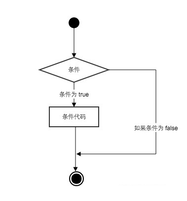
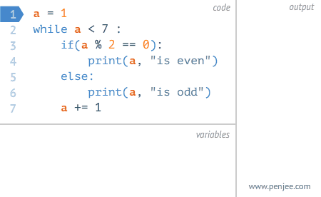

# 条件语句if #

Python 条件语句是通过一条或多条语句的执行结果（True 或者 False）来决定执行的代码块。

可以通过下图来简单了解条件语句的执行过程:


----

## if 语句 ##

Python中if语句的一般形式如下所示：
```python
if condition_1:
    statement_block_1
elif condition_2:
    statement_block_2
else:
    statement_block_3
```

-   如果 "condition_1" 为 True 将执行 "statement_block_1" 块语句
-   如果 "condition_1" 为False，将判断 "condition_2"
-   如果"condition_2" 为 True 将执行 "statement_block_2" 块语句
-   如果 "condition_2" 为False，将执行"statement_block_3"块语句

Python 中用 elif 代替了 else if，所以if语句的关键字为：if – elif – else。

**注意：**

-   每个条件后面要使用冒号 :，表示接下来是满足条件后要执行的语句块。
-   使用缩进来划分语句块，相同缩进数的语句在一起组成一个语句块。
-   在Python中没有switch – case语句。

Gif演示：


**实例1：**

```python
var1 = 100
if var1:
    print ("1 - if 表达式条件为 true")
    print (var1)
 
var2 = 0
if var2:
    print ("2 - if 表达式条件为 true")
    print (var2)
print ("Good bye!")
```

**实例2：**
```python
age = int(input("请输入你家狗狗的年龄: "))
print("")
if age < 0:
    print("你是在逗我吧!")
elif age == 1:
    print("相当于 14 岁的人。")
elif age == 2:
    print("相当于 22 岁的人。")
elif age > 2:
    human = 22 + (age -2)*5
    print("对应人类年龄: ", human)
 
### 退出提示
input("点击 enter 键退出")
```

以下为if中常用的操作运算符:

|   操作符	|   描述|
|   ----	|   ----|
|   <	|   小于   |
|   <=	|   小于或等于|
|   >	|   大于|
|   >=	|   大于或等于|
|   ==	|   等于，比较两个值是否相等|
|   !=	|   不等于|

## If嵌套 ##

在嵌套 if 语句中，可以把 if...elif...else 结构放在另外一个 if...elif...else 结构中。

    if 表达式1:
        语句
        if 表达式2:
            语句
        elif 表达式3:
            语句
        else:
            语句
    elif 表达式4:
        语句
    else:
        语句

实例：
```python
num=int(input("输入一个数字："))
if num%2==0:
    if num%3==0:
        print ("你输入的数字可以整除 2 和 3")
    else:
        print ("你输入的数字可以整除 2，但不能整除 3")
else:
    if num%3==0:
        print ("你输入的数字可以整除 3，但不能整除 2")
    else:
        print  ("你输入的数字不能整除 2 和 3")
```