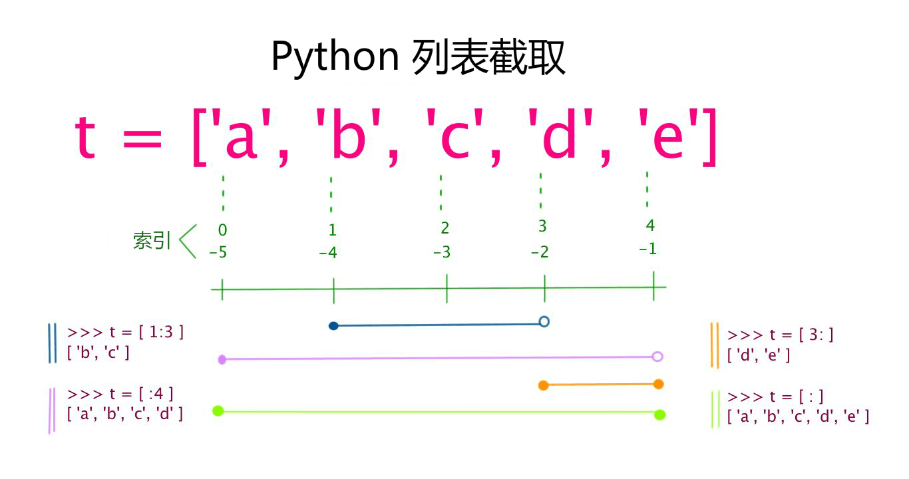
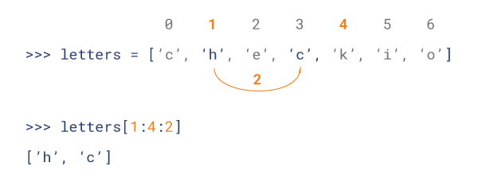

# 基本数据类型 #
Python 中的变量不需要声明。每个变量在使用前都必须赋值，变量赋值以后该变量才会被创建。

在 Python 中，变量就是变量，它没有类型，我们所说的"类型"是变量所指的内存中对象的类型。

等号（=）用来给变量赋值。

等号（=）运算符左边是一个变量名,等号（=）运算符右边是存储在变量中的值。

变量存储在内存中的值。这就意味着在创建变量时会在内存中开辟一个空间。基于变量的数据类型，解释器会分配指定内存，并决定什么数据可以被存储在内存中。因此，变量可以指定不同的数据类型，这些变量可以存储整数，小数或字符。

    多变量赋值：
    a = b = c = 1
    a, b, c = 1, 2, "runoob"

----

## 标准数据类型 ##

Python3 中有六个标准的数据类型：

- Number（数字）
- String（字符串）
- List（列表）
- Tuple（元组）
- Set（集合）
- Dictionary（字典）

Python3 的六个标准数据类型中：

- 不可变数据（3 个）：Number（数字）、String（字符串）、Tuple（元组）；
- 可变数据（3 个）：List（列表）、Dictionary（字典）、Set（集合）。

[**具体解释请参考链接**](https://www.cnblogs.com/zihe/p/6962787.html)

----

## 数据类型判断 ##

内置的 type() 函数可以用来查询变量所指的对象类型。
```python
>>> a, b, c, d = 20, 5.5, True, 4+3j
>>> print(type(a), type(b), type(c), type(d))
<class 'int'> <class 'float'> <class 'bool'> <class 'complex'>
```
也可以用 isinstance 来判断：
```python
>>>a = 111
>>> isinstance(a, int)
True
```

isinstance 和 type 的区别在于：

- type() 得到未知变量所属的类型。
- isinstance() 用来判断继承关系，即子类对象是否继承于父类。

两者使用场景不同，type主要用于获取未知变量的类型，而instance用于继承关系的判断

----

## Number(数字)  ##

python中数字有四种类型：整数、布尔型、浮点数和复数。

- int (整数), 如 1, 只有一种整数类型 int，表示为长整型，没有 python2 中的 Long。
- bool (布尔), 如 True。
- float (浮点数), 如 1.23、3E-2
- complex (复数), 如 1 + 2j、 1.1 + 2.2j

数值运算：
```python
>>>5 + 4  # 加法
9
>>> 4.3 - 2 # 减法
2.3
>>> 3 * 7  # 乘法
21
>>> 2 / 4  # 除法，得到一个浮点数
0.5
>>> 2 // 4 # 除法，得到一个整数
0
>>> 17 % 3 # 取余 
2
>>> 2 ** 5 # 乘方
32
```

注意：
- Python可以同时为多个变量赋值，如a, b = 1, 2。
- 一个变量可以通过赋值指向不同类型的对象。
- 数值的除法包含两个运算符：/ 返回一个浮点数，// 返回一个整数。
- 在混合计算时，Python会把整型转换成为浮点数。

----

## String(字符串) ##

- python中单引号和双引号使用完全相同。
- 使用三引号('''或""")可以指定一个多行字符串。
- 转义符 `'\'`
- 反斜杠可以用来转义，使用r可以让反斜杠不发生转义。。 如 r"this is a line with \n" 则\n会显示，并不是换行。
- 按字面意义级联字符串，如"this " "is " "string"会被自动转换为this is string。
- 字符串可以用 + 运算符连接在一起，用 * 运算符重复。
- Python 中的字符串有两种索引方式，从左往右以 0 开始，从右往左以 -1 开始。
- Python中的字符串不能改变。
- Python 没有单独的字符类型，一个字符就是长度为 1 的字符串。
- 字符串的截取的语法格式如下：变量[头下标:尾下标:步长]

```python
str='Runoob'
 
print(str)                 # 输出字符串
print(str[0:-1])           # 输出第一个到倒数第二个的所有字符
print(str[0])              # 输出字符串第一个字符
print(str[2:5])            # 输出从第三个开始到第五个的字符
print(str[2:])             # 输出从第三个开始的后的所有字符
print(str * 2)             # 输出字符串两次
print(str + '你好')        # 连接字符串
 
print('------------------------------')
 
print('hello\nrunoob')      # 使用反斜杠(\)+n转义特殊字符
print(r'hello\nrunoob')     # 在字符串前面添加一个 r，表示原始字符串，不会发生转义
```

----

## List（列表） ##

List（列表） 是 Python 中使用最频繁的数据类型。

列表可以完成大多数集合类的数据结构实现。列表中元素的类型可以不相同，它支持数字，字符串甚至可以包含列表（所谓嵌套）。

列表是写在方括号 [] 之间、用逗号分隔开的元素列表。

和字符串一样，列表同样可以被索引和截取，列表被截取后返回一个包含所需元素的新列表。

列表截取的语法格式如下：
    
    变量[头下标:尾下标]

索引值以 0 为开始值，-1 为从末尾的开始位置。



加号 + 是列表连接运算符，星号 * 是重复操作。如下实例：

```python
list = [ 'abcd', 786 , 2.23, 'runoob', 70.2 ]
tinylist = [123, 'runoob']
 
print (list)            # 输出完整列表
print (list[0])         # 输出列表第一个元素
print (list[1:3])       # 从第二个开始输出到第三个元素
print (list[2:])        # 输出从第三个元素开始的所有元素
print (tinylist * 2)    # 输出两次列表
print (list + tinylist) # 连接列表

```

    注意：与Python字符串不一样的是，列表中的元素是可以改变的：

List 内置了有很多方法，例如 append()、pop() 等等，这在后面会讲到。

注意：

- List写在方括号之间，元素用逗号隔开。
- 和字符串一样，list可以被索引和切片。
- List可以使用+操作符进行拼接。
- List中的元素是可以改变的。

Python 列表截取可以接收第三个参数，参数作用是截取的步长，以下实例在索引 1 到索引 4 的位置并设置为步长为 2（间隔一个位置）来截取字符串：



----

## Tuple（元组） ##

元组（tuple）与列表类似，不同之处在于元组的元素不能修改。元组写在小括号 () 里，元素之间用逗号隔开。

元组中的元素类型也可以不相同：

```python
tuple = ( 'abcd', 786 , 2.23, 'runoob', 70.2  )
tinytuple = (123, 'runoob')
 
print (tuple)             # 输出完整元组
print (tuple[0])          # 输出元组的第一个元素
print (tuple[1:3])        # 输出从第二个元素开始到第三个元素
print (tuple[2:])         # 输出从第三个元素开始的所有元素
print (tinytuple * 2)     # 输出两次元组
print (tuple + tinytuple) # 连接元组
```

元组与字符串类似，可以被索引且下标索引从0开始，-1 为从末尾开始的位置。也可以进行截取（看上面，这里不再赘述）。

其实，可以把字符串看作一种特殊的元组。

虽然tuple的元素不可改变，但它可以包含可变的对象，比如list列表。

构造包含 0 个或 1 个元素的元组比较特殊，所以有一些额外的语法规则：
```python
tup1 = ()    # 空元组
tup2 = (20,) # 一个元素，需要在元素后添加逗号
```

string、list 和 tuple 都属于 sequence（序列）。

注意：

- 与字符串一样，元组的元素不能修改。
- 元组也可以被索引和切片，方法一样。
- 注意构造包含 0 或 1 个元素的元组的特殊语法规则。
- 元组也可以使用+操作符进行拼接。

----

## Set(集合) ##

集合（set）是由一个或数个形态各异的大小整体组成的，构成集合的事物或对象称作元素或是成员。

基本功能是进行成员关系测试和删除重复元素。

可以使用大括号 { } 或者 set() 函数创建集合，注意：创建一个空集合必须用 set() 而不是 { }，因为 { } 是用来创建一个空字典。

创建格式：

```python
parame = {value01,value02,...}
    或者
set(value)
```

```python
student = {'Tom', 'Jim', 'Mary', 'Tom', 'Jack', 'Rose'}
 
print(student)   # 输出集合，重复的元素被自动去掉
 
# 成员测试
if 'Rose' in student :
    print('Rose 在集合中')
else :
    print('Rose 不在集合中')
 
 
# set可以进行集合运算
a = set('abracadabra')
b = set('alacazam')
 
print(a)
 
print(a - b)     # a 和 b 的差集
 
print(a | b)     # a 和 b 的并集
 
print(a & b)     # a 和 b 的交集
 
print(a ^ b)     # a 和 b 中不同时存在的元素
```

----

## Dictionary（字典） ##

字典（dictionary）是Python中另一个非常有用的内置数据类型。

列表是有序的对象集合，字典是无序的对象集合。两者之间的区别在于：字典当中的元素是通过键来存取的，而不是通过偏移存取。

字典是一种映射类型，字典用 { } 标识，它是一个无序的 键(key) : 值(value) 的集合。

键(key)必须使用不可变类型。

在同一个字典中，键(key)必须是唯一的。

```python
dict = {}
dict['one'] = "1 - 教程"
dict[2]     = "2 - 工具"
 
tinydict = {'name': 'baidu','code':1, 'site': 'www.baidu.com'}
 
 
print (dict['one'])       # 输出键为 'one' 的值
print (dict[2])           # 输出键为 2 的值
print (tinydict)          # 输出完整的字典
print (tinydict.keys())   # 输出所有键
print (tinydict.values()) # 输出所有值
```

构造函数 dict() 可以直接从键值对序列中构建字典如下：

```python
>>>dict([('JD', 1), ('Google', 2), ('Taobao', 3)])
{'Taobao': 3, 'JD': 1, 'Google': 2}
 
>>> {x: x**2 for x in (2, 4, 6)}
{2: 4, 4: 16, 6: 36}
 
>>> dict(JD=1, Google=2, Taobao=3)
{'JD': 1, 'Google': 2, 'Taobao': 3}
```

另外，字典类型也有一些内置的函数，例如clear()、keys()、values()等。

注意：

- 字典是一种映射类型，它的元素是键值对。
- 字典的关键字必须为不可变类型，且不能重复。
-  创建空字典使用 { }。

----

## 布尔值 ##

布尔值和布尔代数的表示完全一致，一个布尔值只有 `True` 、 `False `两种值，要么是 `True`，要么是 `False`，在 Python 中，可以直接用 True、False 表示布尔值（请注意大小写），也可以通过布尔运算计算出来。

布尔值可以用 `and`、`or` 和 `not` 运算。

`and` 运算是与运算，只有所有都为 True，and 运算结果才是 True。

`or` 运算是或运算，只要其中有一个为 True，or 运算结果就是 True。

`not` 运算是非运算，它是一个单目运算符，把 True 变成 False，False 变成 True。

----

## 空值 ##

基本上每种编程语言都有自己的特殊值——空值，在 Python 中，用 None 来表示。

----

## 数据类型转换 ##

有时候，我们需要对数据内置的类型进行转换，数据类型的转换，你只需要将数据类型作为函数名即可。

以下几个内置的函数可以执行数据类型之间的转换。这些函数返回一个新的对象，表示转换的值。

|   函数	|   描述|
|   ----    | ----|
|   int(x [,base]) |    将x转换为一个整数|
|   float(x)    |   将x转换到一个浮点数|
|   complex(real [,imag])   |   创建一个复数|
|   str(x)  |   将对象 x 转换为字符串|
|   repr(x) |   将对象 x 转换为表达式字符串|
|   eval(str)   |   用来计算在字符串中的有效Python表达式,并返回一个对象|
|   tuple(s)    |   将序列 s 转换为一个元组|
|   list(s) |   将序列 s 转换为一个列表|
|   set(s)  |   转换为可变集合|
|   dict(d) |   创建一个字典。d 必须是一个序列 (key,value)元组。|
|   frozenset(s)    |   转换为不可变集合|
|   chr(x)  |   将一个整数转换为一个字符|
|   ord(x)  |   将一个字符转换为它的整数值|
|   hex(x)  |   将一个整数转换为一个十六进制字符串|
|   oct(x)  |   将一个整数转换为一个八进制字符串|

